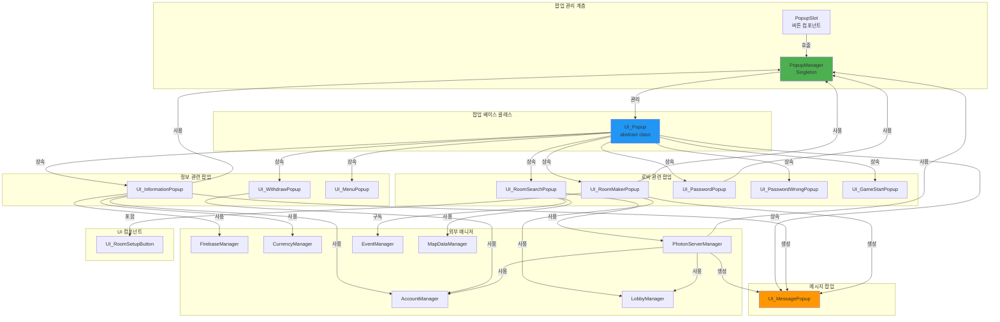
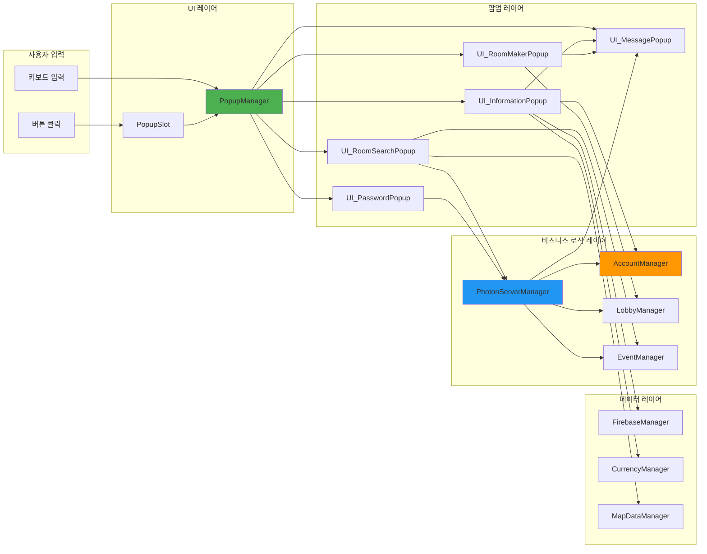
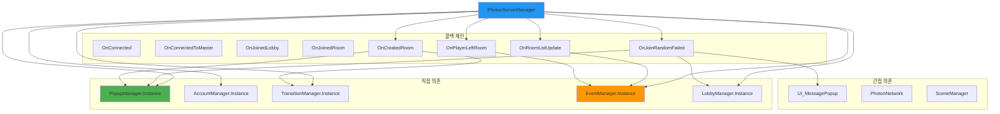
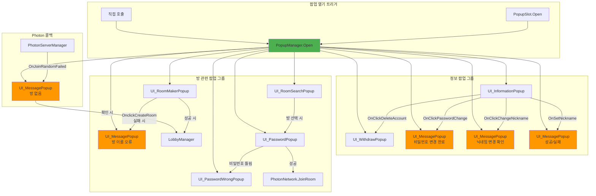
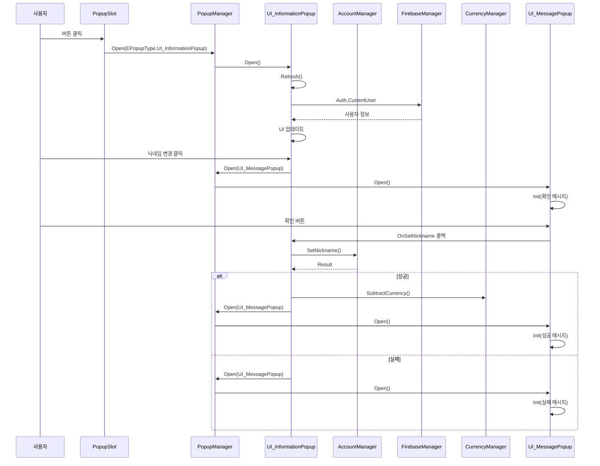
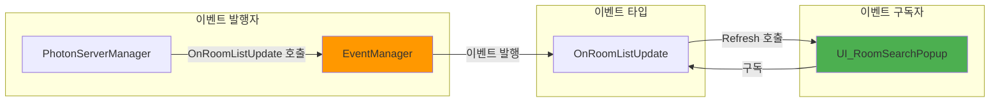

# 클래스 관계도 및 의존성 분석

## 1. 전체 클래스 관계도

```mermaid
classDiagram
    class MonoBehaviour {
        <<Unity>>
    }
    
    class Singleton~T~ {
        <<abstract>>
        +static T Instance
        #Awake()
    }
    
    class MonoBehaviourPunCallbacks {
        <<Photon>>
    }
    
    class UI_Popup {
        <<abstract>>
        -Action _closeCallback
        +Open(Action)
        +Close()
    }
    
    class PopupManager {
        -List~UI_Popup~ PopupList
        -Stack~UI_Popup~ _popupStack
        -UI_IngameChatPopup _ingameChatPopup
        +Open(EPopupType, Action)
        +Close(EPopupType)
        -PopupOpen(string, Action)
        -PopupClose(string)
    }
    
    class PopupSlot {
        +EPopupType Popup
        -Button _button
        +Open()
        +Close()
    }
    
    class UI_MessagePopup {
        +Button OKButton
        +Button CancleButton
        +TextMeshProUGUI MessageText
        -Action _callback
        +Init(string, bool, Action)
        +SetText(string)
        +SetCallback(Action)
        +OnClickOK()
        +OnClickCancle()
    }
    
    class UI_InformationPopup {
        -TextMeshProUGUI _emailText
        -TextMeshProUGUI _tagText
        -TextMeshProUGUI _nicknameText
        -TMP_InputField _nicknameInputField
        +Refresh()
        +OnClickPasswordChange()
        +OnClickDeleteAccount()
        +OnClickChangeNickname()
        +OnSetNickname()
    }
    
    class UI_WithdrawPopup {
        -string LogoutRedirectSceneName
        +OnClickCloseButton()
        +OnClickConfirmButton()
    }
    
    class UI_MenuPopup {
    }
    
    class UI_GameStartPopup {
    }
    
    class UI_PasswordPopup {
        +TMP_InputField PasswordInputField
        -RoomInfo _currentRoomInfo
        -string _tempPassword
        +SetRoomInfo(RoomInfo)
        +PasswordCheck()
        -Fail()
        -Success(string)
    }
    
    class UI_PasswordWrongPopup {
    }
    
    class UI_RoomMakerPopup {
        +TMP_InputField RoomName
        +TMP_InputField RoomPassword
        +string BlankRoomName
        +int MaxPlayerCount
        +Toggle IsLocked
        +Toggle[] MaxPlayers
        +UI_RoomSetupButton PlayTime
        +UI_RoomSetupButton Life
        +UI_RoomSetupButton Gunpowder
        +UI_RoomSetupButton Decline
        +OnclickCreateRoom()
        +OnClickMaxPlayer(int)
        +LockedButton()
    }
    
    class UI_RoomSearchPopup {
        +List~UI_RoomSlot~ RoomSlotList
        +TextMeshProUGUI RoomPageTextUGUI
        -int _currentPage
        -int _maxPage
        +Refresh()
        +OnClickSetPage(int)
        -StringToSprite(RoomInfo)
        -PageSetting()
    }
    
    class UI_RoomSetupButton {
        +TextMeshProUGUI Value
        +int MaxValue
        +int MinValue
        +int InitValue
        -int _currentValue
        +Init()
        +ValueUpDown(int)
        +Refresh()
        +Reset(int)
        +CurrentValue() int
    }
    
    class PhotonServerManager {
        +static PhotonServerManager Instance
        -int _sendRate
        -int _serializationRate
        -string _gameVersion
        -List~RoomInfo~ _roomInfoList
        -bool _isTutorial
        -bool _isFirst
        +Connect(bool)
        +TutorialMode()
        +SetPhotonPrefabPool(Dictionary)
        +SetFirst(bool)
        +OnConnected()
        +OnDisconnected(DisconnectCause)
        +OnConnectedToMaster()
        +OnJoinedLobby()
        +OnJoinRandomFailed(short, string)
        +OnJoinedRoom()
        +OnCreatedRoom()
        +OnPlayerLeftRoom(PhotonPlayer)
        +OnRoomListUpdate(List~RoomInfo~)
    }
    
    class AccountManager {
        <<Singleton>>
        +CurrentAccount
        +ChangePassword()
        +SetNickname(string) Result
        +DeleteAccount()
        +Logout()
    }
    
    class FirebaseManager {
        +Auth
    }
    
    class CurrencyManager {
        <<Singleton>>
        +SubtractCurrency(ECurrencyType, int)
    }
    
    class LobbyManager {
        <<Singleton>>
        +MakeRoom(string, int, int, int, int, int, bool, string)
    }
    
    class EventManager {
        <<Singleton>>
        +OnRoomListUpdate event
        +PlayerLeft(PhotonPlayer)
        +PlayerLeftRoom(PhotonPlayer)
        +PlayerFind()
        +RoomListUpdate()
    }
    
    class MapDataManager {
        <<Singleton>>
        +GetThemeData(EMap) MapThemeData
    }
    
    class TransitionManager {
        <<Singleton>>
        +LoadLevel(ESceneList)
    }
    
    %% 상속 관계
    Singleton~T~ <|-- PopupManager : extends
    MonoBehaviour <|-- Singleton~T~ : extends
    MonoBehaviour <|-- PopupSlot : extends
    MonoBehaviour <|-- UI_Popup : extends
    MonoBehaviourPunCallbacks <|-- PhotonServerManager : extends
    
    UI_Popup <|-- UI_MessagePopup : extends
    UI_Popup <|-- UI_InformationPopup : extends
    UI_Popup <|-- UI_WithdrawPopup : extends
    UI_Popup <|-- UI_MenuPopup : extends
    UI_Popup <|-- UI_GameStartPopup : extends
    UI_Popup <|-- UI_PasswordPopup : extends
    UI_Popup <|-- UI_PasswordWrongPopup : extends
    UI_Popup <|-- UI_RoomMakerPopup : extends
    UI_Popup <|-- UI_RoomSearchPopup : extends
    
    %% 의존성 관계
    PopupSlot --> PopupManager : uses Instance
    PopupManager --> UI_Popup : manages List
    PopupManager --> UI_IngameChatPopup : caches reference
    
    UI_InformationPopup --> PopupManager : uses Instance
    UI_InformationPopup --> AccountManager : uses Instance
    UI_InformationPopup --> FirebaseManager : uses Instance
    UI_InformationPopup --> CurrencyManager : uses Instance
    UI_InformationPopup --> UI_MessagePopup : creates
    
    UI_WithdrawPopup --> AccountManager : uses Instance
    
    UI_MessagePopup --> PopupManager : used by
    
    PhotonServerManager --> PopupManager : uses Instance
    PhotonServerManager --> AccountManager : uses Instance
    PhotonServerManager --> TransitionManager : uses Instance
    PhotonServerManager --> EventManager : uses Instance
    PhotonServerManager --> LobbyManager : uses Instance
    PhotonServerManager --> UI_MessagePopup : creates
    
    UI_PasswordPopup --> PopupManager : uses Instance
    UI_PasswordPopup --> PhotonNetwork : uses
    
    UI_RoomMakerPopup --> PopupManager : uses Instance
    UI_RoomMakerPopup --> LobbyManager : uses Instance
    UI_RoomMakerPopup --> UI_MessagePopup : creates
    UI_RoomMakerPopup --> UI_RoomSetupButton : contains 4x
    
    UI_RoomSearchPopup --> PhotonServerManager : uses Instance
    UI_RoomSearchPopup --> EventManager : subscribes to
    UI_RoomSearchPopup --> MapDataManager : uses Instance
    UI_RoomSearchPopup --> UI_RoomSlot : contains List
```



## 2. 팝업 시스템 구조



## 3. 의존성 흐름도



## 4. PhotonServerManager 의존성 상세



## 5. 팝업 간 상호작용 관계



## 6. 데이터 흐름도



## 7. 컴포넌트 구성 관계

```mermaid
graph TB
    subgraph "UI_RoomMakerPopup 구성"
        RMP[UI_RoomMakerPopup]
        RN[TMP_InputField<br/>RoomName]
        RP[TMP_InputField<br/>RoomPassword]
        IL[Toggle<br/>IsLocked]
        MP[Toggle[]<br/>MaxPlayers]
        PT[UI_RoomSetupButton<br/>PlayTime]
        LF[UI_RoomSetupButton<br/>Life]
        GP[UI_RoomSetupButton<br/>Gunpowder]
        DC[UI_RoomSetupButton<br/>Decline]
    end
    
    subgraph "UI_RoomSetupButton 내부"
        RSB[UI_RoomSetupButton]
        VT[TextMeshProUGUI<br/>Value]
        MV[int MaxValue]
        MN[int MinValue]
        IV[int InitValue]
        CV[int _currentValue]
    end
    
    subgraph "UI_InformationPopup 구성"
        IP[UI_InformationPopup]
        ET[TextMeshProUGUI<br/>_emailText]
        TT[TextMeshProUGUI<br/>_tagText]
        NT[TextMeshProUGUI<br/>_nicknameText]
        NF[TMP_InputField<br/>_nicknameInputField]
    end
    
    subgraph "UI_MessagePopup 구성"
        MSP[UI_MessagePopup]
        OKB[Button<br/>OKButton]
        CB[Button<br/>CancleButton]
        MT[TextMeshProUGUI<br/>MessageText]
        AC[Action<br/>_callback]
    end
    
    RMP --> RN
    RMP --> RP
    RMP --> IL
    RMP --> MP
    RMP --> PT
    RMP --> LF
    RMP --> GP
    RMP --> DC
    
    PT --> RSB
    LF --> RSB
    GP --> RSB
    DC --> RSB
    
    RSB --> VT
    RSB --> MV
    RSB --> MN
    RSB --> IV
    RSB --> CV
    
    IP --> ET
    IP --> TT
    IP --> NT
    IP --> NF
    
    MSP --> OKB
    MSP --> CB
    MSP --> MT
    MSP --> AC
    
    style RMP fill:#4CAF50
    style IP fill:#2196F3
    style MSP fill:#FF9800
    style RSB fill:#9C27B0
```

## 8. 이벤트 구독 관계



## 주요 관계 요약

### 상속 관계
- `PopupManager` → `Singleton<PopupManager>` → `MonoBehaviour`
- 모든 팝업 클래스 → `UI_Popup` → `MonoBehaviour`
- `PhotonServerManager` → `MonoBehaviourPunCallbacks`

### 의존성 관계
- **PopupSlot** → PopupManager (Instance 사용)
- **모든 팝업** → PopupManager (Instance 사용)
- **UI_InformationPopup** → AccountManager, FirebaseManager, CurrencyManager
- **UI_RoomMakerPopup** → LobbyManager, UI_RoomSetupButton (4개)
- **UI_RoomSearchPopup** → PhotonServerManager, EventManager, MapDataManager
- **PhotonServerManager** → PopupManager, AccountManager, TransitionManager, EventManager, LobbyManager

### 구성 관계
- **UI_RoomMakerPopup**는 4개의 **UI_RoomSetupButton**을 포함
- **UI_MessagePopup**는 Action 콜백을 통해 다른 팝업과 통신

### 이벤트 관계
- **EventManager**는 **UI_RoomSearchPopup**에 이벤트를 발행
- **PhotonServerManager**는 **EventManager**를 통해 이벤트를 전달


