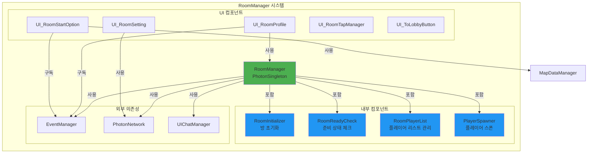
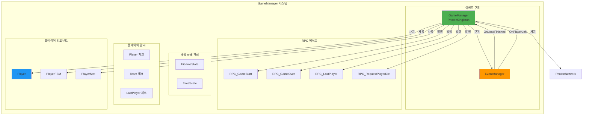
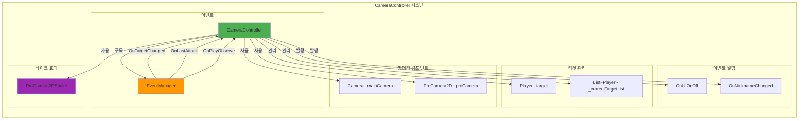
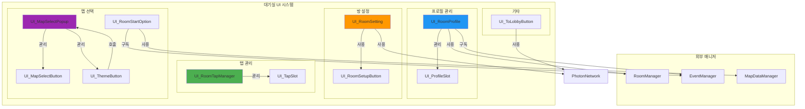
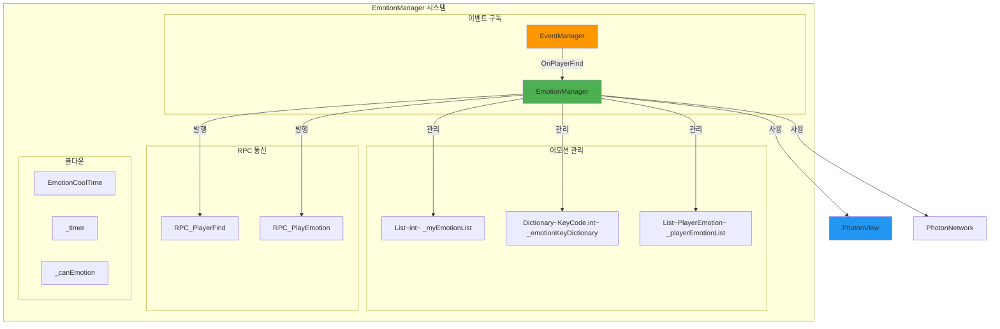
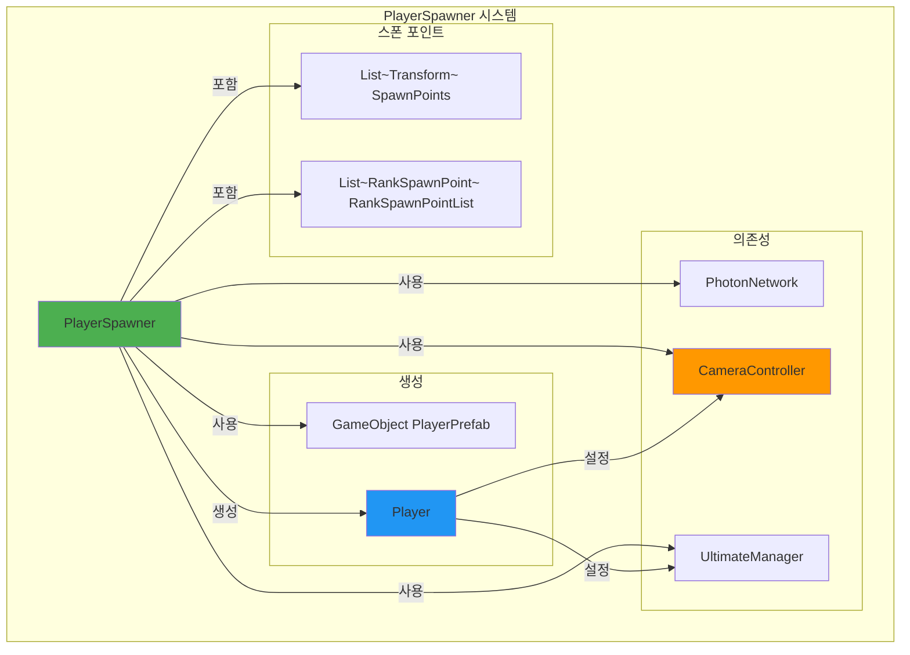
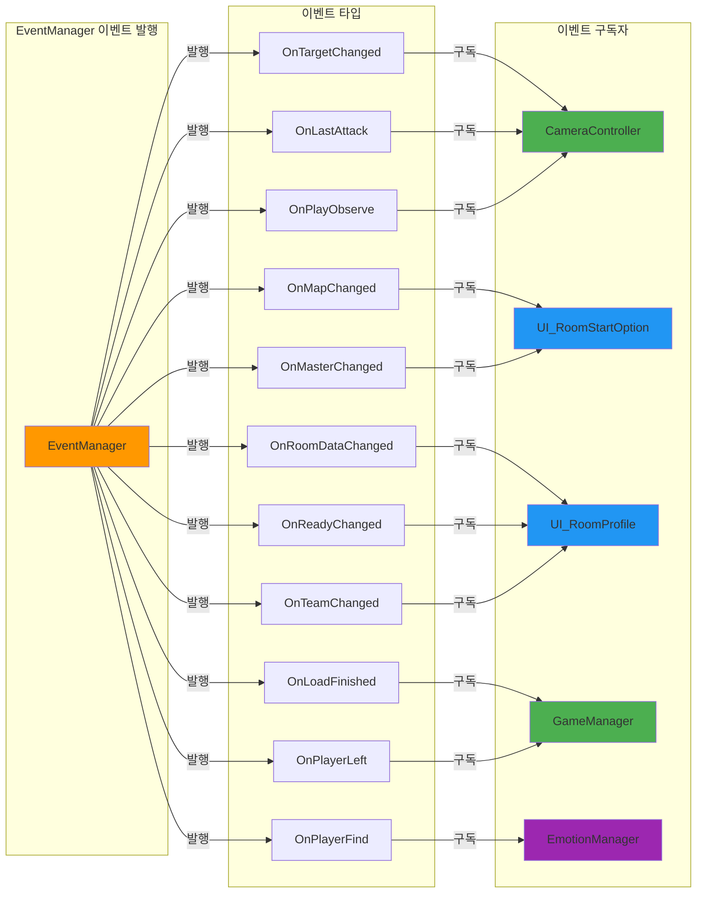
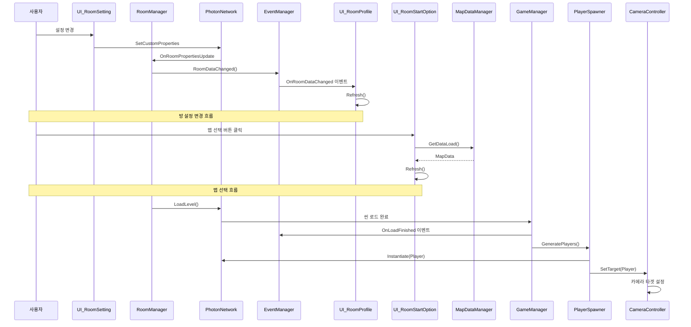

# 클래스 관계도 및 의존성 분석 (Part 2)

## 1. 전체 클래스 관계도

```mermaid
classDiagram
    class MonoBehaviour {
        <<Unity>>
    }
    
    class MonoBehaviourPunCallbacks {
        <<Photon>>
    }
    
    class PhotonSingleton~T~ {
        <<abstract>>
        +static T Instance
        #Awake()
    }
    
    class Singleton~T~ {
        <<abstract>>
        +static T Instance
        #Awake()
    }
    
    class UI_Popup {
        <<abstract>>
        +Open(Action)
        +Close()
    }
    
    class CameraController {
        -Camera _mainCamera
        -ProCamera2D _proCamera
        -Player _target
        -bool _isObserving
        -List~Player~ _currentTargetList
        -int _currentTargetIndex
        +float TargetZoomDuration
        +float TargetZoomAmount
        +event Action~bool~ OnUIOnOff
        +event Action~string~ OnNicknameChanged
        +SetTarget(Player)
        +ExplosionShake(Transform, float)
        +SmallShakeAt(Transform, float)
        +SelectTarget(int)
        -HitShake()
        -GunShotShake()
        -SetObserveTarget()
        -PlayObservingMode()
        -LastAttack(int)
    }
    
    class UI_RoomTapManager {
        +List~UI_TapSlot~ TapDataList
        +SelectTap(ETapOption)
        +Onclick(ETapOption)
        +OnclickOnlyMaster(ETapOption)
        -Init()
    }
    
    class UI_TapSlot {
        +ETapOption TapType
        +GameObject TapObject
        +Button TapButton
        +bool IsMaster
        +SetActive(ETapOption)
    }
    
    class UI_RoomStartOption {
        +Button MapSelectButton
        +Image MapIcon
        +TextMeshProUGUI MapNameGUGI
        +ButtonSetup()
        +MapChange(EMap)
        -Refresh(string, Sprite)
    }
    
    class UI_RoomSetting {
        -int PlaytimeInit
        -int PowderInit
        -int DeclineInit
        -int LifeInit
        +UI_RoomSetupButton Playtime
        +UI_RoomSetupButton Powder
        +UI_RoomSetupButton Life
        +AcceptButton()
        +CancelButton()
        -Init(ERoomProperties, UI_RoomSetupButton) int
    }
    
    class UI_RoomSetupButton {
        +TextMeshProUGUI Value
        +int MaxValue
        +int MinValue
        +int InitValue
        -int _currentValue
        +Init()
        +ValueUpDown(int)
        +Refresh()
        +Reset(int)
        +CurrentValue() int
    }
    
    class UI_ToLobbyButton {
        -float _clickDelay
        -float _timer
        -bool _isClick
        -Button _button
        +OnClickToLobby()
    }
    
    class UI_RoomProfile {
        +List~UI_ProfileSlot~ UI_ProfileSlotList
        +Refresh()
        +ReadyCheck(PhotonPlayer)
        +TeamChange()
    }
    
    class UI_ProfileSlot {
        +Refresh(PhotonPlayer)
        +MasterCheck(bool)
        +ReadyCheck(PhotonPlayer)
        +TeamSet(PhotonPlayer)
    }
    
    class UI_MapSelectPopup {
        +List~UI_MapSelectButton~ UI_MapSelectButtonList
        +List~UI_ThemeButton~ UI_ThemeButtonList
        +EMap Map
        +EMapTheme Theme
        -List~MapData~ _mapDataList
        +ChangeTheme(EMapTheme)
        -Init()
        -LoadCurrentMap(EMap, EMapTheme)
        -Refresh(EMapTheme)
        -ThemeRefresh(EMapTheme)
        -MapRefresh(List~MapData~)
        -SetMapList(List~MapData~)
    }
    
    class UI_MapSelectButton {
        +Refresh(EMap, bool, Sprite, string)
    }
    
    class UI_ThemeButton {
        +UI_MapSelectPopup UI_MapSelectPopup
        +EMapTheme Theme
        +TextMeshProUGUI ThemeNameText
        +Image ThemeImage
        +GameObject IsSelected
        +Refresh(EMapTheme, Sprite, string)
        +SelectCheck(EMapTheme)
        +OnClickTheme()
    }
    
    class RoomManager {
        -Room _room
        -PhotonView _photonView
        +int MaxPlayerCount
        +RoomInitializer Initializer
        +RoomReadyCheck ReadyCheck
        +RoomPlayerList PlayerList
        +PlayerSpawner Spawner
        +EMap SelectedMap
        +EInGameTeam SelectedTeam
        -bool _initialized
        +GameStart()
        +PlayerLeft(PhotonPlayer)
        +Rpc_UpdateSlots(int[])
        -Init()
        -SetRoom()
    }
    
    class RoomInitializer {
        +Init(RoomManager)
        +PlayerInitial(int)
    }
    
    class RoomReadyCheck {
        +CheckReady() bool
    }
    
    class RoomPlayerList {
        +List~int~ PlayerSlotList
        +AddPlayerPlacement(PhotonPlayer)
        +SubPlayerPlacement(PhotonPlayer)
        +GetPlayerList(int[])
        +PlayerListCheck()
    }
    
    class GameManager {
        -Dictionary~EInGameTeam,int~ _teamCount
        -PhotonView _photonView
        -EGameState _currentGameState
        +bool LastPlayer
        -GameObject _myPlayer
        +Transform ResurrectPoint
        +event Action~PhotonPlayer~ OnTimeCheck
        +RequestGameOver()
        +GameStartSetting()
        +GameResultCheck()
        +GameStateChange(EGameState)
        +TimeScaleSetting()
        -Init()
        -PlayerLastCheck(PhotonPlayer)
        -PlayerDeadCheck()
        -GameOverToPlayerLeft()
        -TeamSetting()
        -LastTeamCheck() int
        -LastAttackCheck(EInGameTeam) bool
        +RPC_GameStart()
        +RPC_GameOver()
        +RPC_LastPlayer()
        +RPC_RequestPlayerDie(bool)
    }
    
    class EmotionManager {
        +PhotonView MyPhotonView
        -List~int~ _myEmotionList
        -Dictionary~KeyCode,int~ _emotionKeyDictionary
        -List~PlayerEmotion~ _playerEmotionList
        +float EmotionCoolTime
        -float _timer
        -bool _canEmotion
        -Request_PlayerFind()
        -Request_PlayEmotion(int)
        -CoolDown()
        -DefaultEmotion()
        +RPC_PlayerFind()
        +RPC_PlayEmotion(int, PhotonMessageInfo)
    }
    
    class PlayerEmotion {
        +Play(string)
        +GetPlayerNumber() int
        +IsLive bool
    }
    
    class PlayerSpawner {
        +GameObject PlayerPrefab
        +List~Transform~ SpawnPoints
        +List~RankSpawnPoint~ RankSpawnPointList
        +GeneratePlayers(int)
        +GeneratePlayers(int, int)
    }
    
    class RoomStatManager {
        +int PlayerLife
        +int PlayerGunpowder
        +int PlayerDecreaseTime
        +EInGameTeam PlayerTeam
        +bool IsManual
    }
    
    class SceneComplete {
        -float _duration
    }
    
    class EventManager {
        <<Singleton>>
        +event Action~int~ OnTopPlayerChanged
        +event Action~int,int,int,int~ OnDataChanged
        +event Action~EMap~ OnMapChanged
        +event Action OnRoomDataChanged
        +event Action~PhotonPlayer~ OnReadyChanged
        +event Action OnMasterChanged
        +event Action~PhotonPlayer~ OnPlayerLeft
        +event Action OnTeamChanged
        +event Action OnTargetChanged
        +event Action~int~ OnLastAttack
        +event Action OnPlayObserve
        +event Action OnLoadFinished
        +event Action OnGameStart
        +event Action OnGameOver
    }
    
    class MapDataManager {
        <<Singleton>>
        +GetDataLoad(EMap) MapData
        +GetThemeData(EMap) MapThemeData
        +GetThemeDataList() List~MapThemeData~
        +ThemeDataLoad(EMapTheme) List~MapData~
        +LoadMapData()
        +event Action~EMap,EMapTheme~ OnMapDataLoad
    }
    
    class TransitionManager {
        <<Singleton>>
        +LoadLevel(ESceneList)
        +EndAnimation(float)
    }
    
    class UltimateManager {
        <<Singleton>>
        +SetPlayer(Player)
    }
    
    class Player {
        +PhotonView PhotonView
        +event Action OnHit
        +event Action OnAttack
    }
    
    %% 상속 관계
    MonoBehaviour <|-- CameraController : extends
    MonoBehaviour <|-- UI_RoomTapManager : extends
    MonoBehaviour <|-- UI_RoomStartOption : extends
    MonoBehaviour <|-- UI_RoomSetting : extends
    MonoBehaviour <|-- UI_RoomSetupButton : extends
    MonoBehaviour <|-- UI_ToLobbyButton : extends
    MonoBehaviour <|-- UI_RoomProfile : extends
    MonoBehaviour <|-- UI_TapSlot : extends
    MonoBehaviour <|-- UI_ProfileSlot : extends
    MonoBehaviour <|-- UI_MapSelectButton : extends
    MonoBehaviour <|-- UI_ThemeButton : extends
    MonoBehaviour <|-- EmotionManager : extends
    MonoBehaviour <|-- PlayerSpawner : extends
    MonoBehaviour <|-- SceneComplete : extends
    MonoBehaviour <|-- Player : extends
    
    PhotonSingleton~T~ <|-- RoomManager : extends
    PhotonSingleton~T~ <|-- GameManager : extends
    MonoBehaviourPunCallbacks <|-- PhotonSingleton~T~ : extends
    
    Singleton~T~ <|-- RoomStatManager : extends
    MonoBehaviour <|-- Singleton~T~ : extends
    
    UI_Popup <|-- UI_MapSelectPopup : extends
    MonoBehaviour <|-- UI_Popup : extends
    
    %% 구성 관계
    UI_RoomTapManager *-- UI_TapSlot : contains List
    UI_RoomProfile *-- UI_ProfileSlot : contains List
    UI_MapSelectPopup *-- UI_MapSelectButton : contains List
    UI_MapSelectPopup *-- UI_ThemeButton : contains List
    UI_RoomSetting *-- UI_RoomSetupButton : contains 3x
    RoomManager *-- RoomInitializer : contains
    RoomManager *-- RoomReadyCheck : contains
    RoomManager *-- RoomPlayerList : contains
    RoomManager *-- PlayerSpawner : contains
    
    %% 의존성 관계
    CameraController --> EventManager : subscribes to
    CameraController --> Player : uses
    
    UI_RoomStartOption --> EventManager : subscribes to
    UI_RoomStartOption --> MapDataManager : uses Instance
    
    UI_RoomSetting --> PhotonNetwork : uses
    UI_RoomSetting --> UI_RoomSetupButton : uses
    
    UI_ToLobbyButton --> PhotonNetwork : uses
    
    UI_RoomProfile --> EventManager : subscribes to
    UI_RoomProfile --> RoomManager : uses Instance
    UI_RoomProfile --> PhotonNetwork : uses
    
    UI_MapSelectPopup --> MapDataManager : uses Instance
    
    UI_ThemeButton --> UI_MapSelectPopup : uses
    
    RoomManager --> EventManager : uses Instance
    RoomManager --> PhotonNetwork : uses
    RoomManager --> UIChatManager : uses Instance
    
    GameManager --> EventManager : subscribes to
    GameManager --> PhotonNetwork : uses
    GameManager --> Player : uses
    GameManager --> PlayerFSM : uses
    GameManager --> PlayerStat : uses
    
    EmotionManager --> EventManager : subscribes to
    EmotionManager --> PhotonNetwork : uses
    EmotionManager --> PlayerEmotion : uses List
    
    PlayerSpawner --> PhotonNetwork : uses
    PlayerSpawner --> CameraController : uses
    PlayerSpawner --> UltimateManager : uses Instance
    PlayerSpawner --> Player : creates
    
    RoomStatManager --> PhotonNetwork : uses
    
    SceneComplete --> TransitionManager : uses Instance
```



## 2. RoomManager 구조 상세



## 3. GameManager 의존성 상세



## 4. CameraController 의존성



## 5. UI 컴포넌트 관계도



## 6. EmotionManager 시스템



## 7. PlayerSpawner 시스템



## 8. 전체 시스템 통합 관계도

```mermaid
graph TB
    subgraph "게임 시작 흐름"
        SC[SceneComplete]
        SC -->|EndAnimation| TM[TransitionManager]
    end
    
    subgraph "대기실 시스템"
        RM[RoomManager]
        RSM[RoomStatManager]
        URP[UI_RoomProfile]
        URS[UI_RoomSetting]
        URSO[UI_RoomStartOption]
        URTM[UI_RoomTapManager]
        
        RM -->|초기화| RSM
        RM -->|데이터 제공| URP
        URP -->|구독| EM[EventManager]
        URS -->|설정 변경| RM
        URSO -->|맵 선택| RM
    end
    
    subgraph "게임 시작"
        RM -->|GameStart| PNW[PhotonNetwork.LoadLevel]
        PS[PlayerSpawner] -->|생성| P[Player]
        PS -->|설정| CC[CameraController]
        PS -->|설정| UM[UltimateManager]
    end
    
    subgraph "게임 중"
        GM[GameManager]
        CC -->|관찰 모드| P
        EM2[EmotionManager] -->|이모션| PE[PlayerEmotion]
        GM -->|게임 상태 관리| EM
    end
    
    subgraph "이벤트 허브"
        EM -->|발행| 모든 구독자
    end
    
    style RM fill:#4CAF50
    style GM fill:#4CAF50
    style EM fill:#FF9800
    style CC fill:#2196F3
```

## 9. 이벤트 구독 관계 상세



## 10. 데이터 흐름 시퀀스 다이어그램



## 주요 관계 요약

### 상속 관계
- **RoomManager, GameManager** → `PhotonSingleton<T>` → `MonoBehaviourPunCallbacks`
- **RoomStatManager** → `Singleton<T>` → `MonoBehaviour`
- **UI_MapSelectPopup** → `UI_Popup` → `MonoBehaviour`
- 나머지 UI 클래스들 → `MonoBehaviour`

### 구성 관계
- **RoomManager**는 `RoomInitializer`, `RoomReadyCheck`, `RoomPlayerList`, `PlayerSpawner`를 포함
- **UI_RoomTapManager**는 `UI_TapSlot` 리스트를 관리
- **UI_RoomProfile**는 `UI_ProfileSlot` 리스트를 관리
- **UI_MapSelectPopup**는 `UI_MapSelectButton`, `UI_ThemeButton` 리스트를 관리
- **UI_RoomSetting**는 3개의 `UI_RoomSetupButton`을 포함

### 의존성 관계
- **CameraController** → EventManager (구독), Player (사용)
- **UI_RoomStartOption** → EventManager (구독), MapDataManager (사용)
- **UI_RoomProfile** → EventManager (구독), RoomManager (사용)
- **RoomManager** → EventManager (사용), PhotonNetwork (사용)
- **GameManager** → EventManager (구독), PhotonNetwork (사용), Player (사용)
- **EmotionManager** → EventManager (구독), PhotonNetwork (사용), PlayerEmotion (사용)
- **PlayerSpawner** → PhotonNetwork (사용), CameraController (사용), UltimateManager (사용)

### 이벤트 관계
- **EventManager**는 중앙 이벤트 허브로 여러 클래스가 구독/발행
- 주요 이벤트: OnMapChanged, OnRoomDataChanged, OnReadyChanged, OnMasterChanged, OnLoadFinished, OnPlayerLeft, OnTargetChanged, OnLastAttack, OnPlayObserve 등


