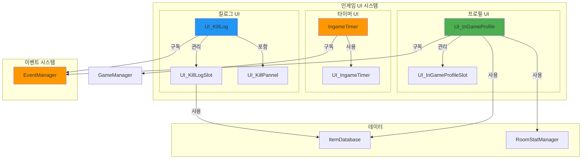
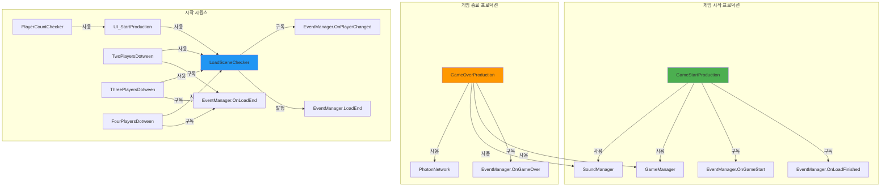
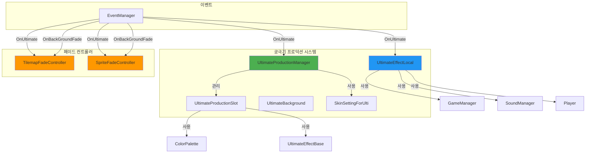
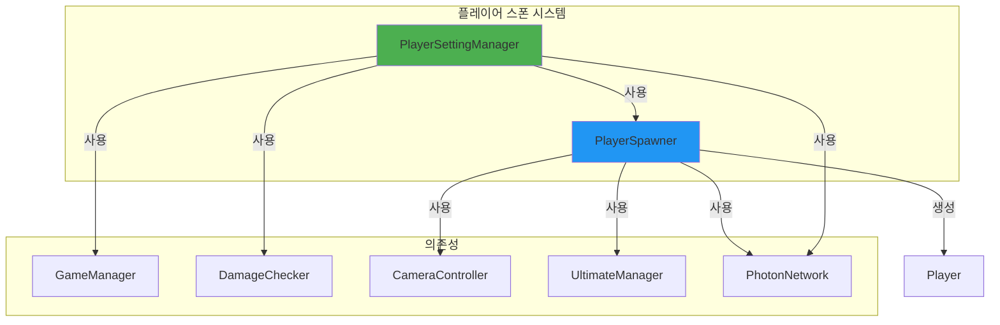
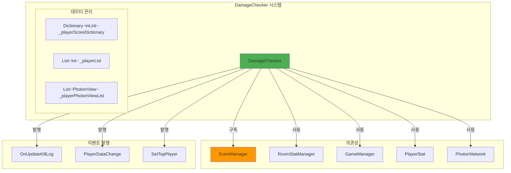
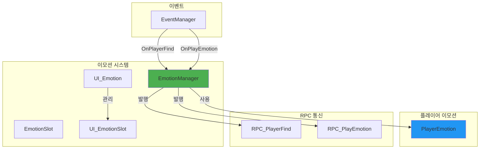
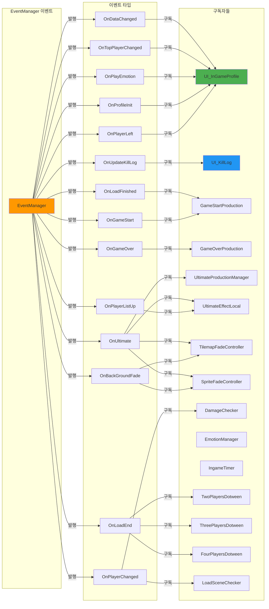
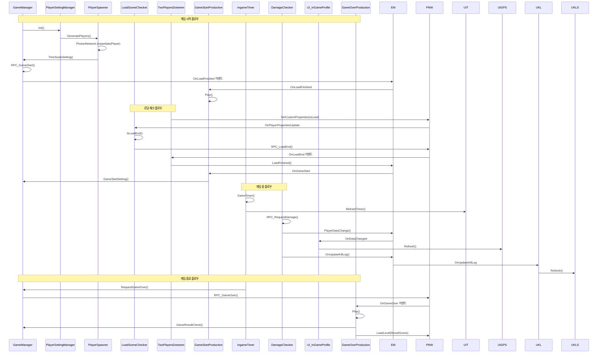

# 클래스 관계도 및 의존성 분석 (Part 3 - 인게임 UI 및 게임 로직)

## 1. 전체 클래스 관계도

```mermaid
classDiagram
    class MonoBehaviour {
        <<Unity>>
    }
    
    class MonoBehaviourPunCallbacks {
        <<Photon>>
    }
    
    class Singleton~T~ {
        <<abstract>>
        +static T Instance
    }
    
    class PhotonSingleton~T~ {
        <<abstract>>
        +static T Instance
    }
    
    class UI_InGameProfile {
        +Image MyBomb
        -List~UI_InGameProfileSlot~ UI_InGameProfileSlotList
        -List~int~ _playerActorNumberList
        +PlayEmotion(string, int)
        -Init()
        -Refresh(int, int, int, int)
        -SetTopPlayer(int)
        -PlayerLeftRefresh(PhotonPlayer)
        -SubscribeEvents()
        -UnsubscribeEvents()
    }
    
    class UI_InGameProfileSlot {
        +Init(Sprite, EInGameTeam, PhotonPlayer, int, int)
        +Refresh(int, int, int)
        +SetTop(bool)
        +PlayEmotion(string)
        +LeftOverRefresh()
    }
    
    class UI_IngameTimer {
        +TextMeshProUGUI TimerTextMeshProUGUI
        +RefreshTimer(int)
    }
    
    class UI_KillLog {
        +List~UI_KillLogSlot~ KillLogSlotList
        +UI_KillPannel KillPannel
        -Dictionary~PhotonPlayer,int~ _playerTeamDictionary
        -PhotonPlayer _myPlayer
        -int _myTeam
        -Init()
        -Refresh(int, bool, int)
        -KillPannelLog(int)
        -TeamCheck(int) bool
    }
    
    class UI_KillLogSlot {
        +RectTransform KillLogPivot
        +TextMeshProUGUI KillPlayerNickname
        +TextMeshProUGUI DeathPlayerNickname
        +Image KillIcon
        +Image KillBackground
        +Image DeathBackground
        +ColorPalette ColorPalette
        +float MoveSpeed
        +float StayTime
        +Ease EaseType
        +Refresh(int, int, bool, bool, bool)
        -Tween_KillLog()
        -GetBombImage(int, int, bool)
        -TeamCheck(bool, bool)
        -GetPlayerNickName(int) string
    }
    
    class UI_KillPannel {
        +TextMeshProUGUI KillPannelText
        +TextMeshProUGUI KillPannelBG
        +Refresh(string)
        -Play()
    }
    
    class GameOverProduction {
        +Animator MyAnimator
        +RectTransform GameOverProductionPanel
        +RectTransform ProfileSlot
        +RectTransform TopPivot
        +RectTransform CameraObject
        +Image BlackOut
        +Play()
        -TimerOff()
        -CameraOn()
        -CameraOff()
        -CameraButtonDown()
    }
    
    class GameStartProduction {
        +RectTransform TopPivot
        +RectTransform Profile
        +GameObject GameStartCountText1
        +GameObject GameStartText
        +GameObject GameStartCountText2
        +GameObject GameStartCountText3
        +Play()
        +GameStart()
        -SoundStart()
    }
    
    class UltimateProductionSlot {
        +List~UltimateEffectBase~ EffectList
        +List~GameObject~ UltimateEffectList
        +GameObject PlayerImage
        +float UltimateTime
        +RectTransform UltimateEffectUp
        +RectTransform UltimateEffectDown
        +Image UpBackGround
        +Image DownBackGround
        +Play(string, bool)
        -BackGroundColorChange(bool)
        -BombEffectOn(string)
        -BombEffectOff(string)
        +AddPlayer(GameObject)
    }
    
    class UltimateProductionManager {
        +Dictionary~int,UltimateProductionSlot~ UltimateProductionSlotDic
        +List~UltimateProductionSlot~ UltimateProductionSlotList
        +SkinSettingForUlti SkinSettingForUlti
        -EInGameTeam _myTeam
        -Init()
        -Play(string, PhotonPlayer)
        -TeamCheck(PhotonPlayer) bool
    }
    
    class UltimateBackground {
        +RectTransform Wind1
        +RectTransform Wind2
        +float WindSpeed
        -MoveWind(RectTransform)
    }
    
    class UltimateEffectLocal {
        +List~GameObject~ EffectList
        +float UltiTime
        +float ColorChangeTime
        +float FadeTime
        +GameObject UltimateBackGround
        -List~PhotonView~ _playerList
        -PlayEffect(string, PhotonPlayer)
        -EffectPool() GameObject
        -UltimateOn()
        -TimeSlow() IEnumerator
        -PlayerListUp()
        -BackGroundColorChange() IEnumerator
        -BackGroundOff()
    }
    
    class TilemapFadeController {
        +Tilemap Tilemap
        +List~Tilemap~ TilemapList
        +bool IsGroup
        -FadeIn(string, PhotonPlayer)
        -FadeIn_Group(string, PhotonPlayer)
        -FadeOut()
        -FadeOut_Group()
    }
    
    class SpriteFadeController {
        +SpriteRenderer MapSpriteRenderer
        +List~SpriteRenderer~ MapSpriteRendererList
        +bool IsGroup
        -FadeIn(string, PhotonPlayer)
        -FadeIn_Group(string, PhotonPlayer)
        -FadeOut()
        -FadeOut_Group()
    }
    
    class SceneLoader {
        +ESceneList AdditiveScene
    }
    
    class PlayerSpawner {
        +GameObject PlayerPrefab
        +List~Transform~ SpawnPoints
        +List~RankSpawnPoint~ RankSpawnPointList
        +GeneratePlayers(int)
        +GeneratePlayers(int, int)
    }
    
    class PlayerSettingManager {
        -List~int~ _playerList
        -PhotonView _photonView
        +PlayerSpawner Spawner
        +Init()
        +Rpc_SpawnPlayer(int[])
        -SpawnSetting()
        -SpawnPlayer()
    }
    
    class DamageChecker {
        -PhotonView _photonView
        -int _currentTopPlayer
        -Dictionary~int,int~ _playerScoreDictionary
        -List~int~ _playerList
        -List~PhotonView~ _playerPhotonViewList
        +SetPlayerView()
        +ActiveKillLog(int, bool, int)
        +RPC_RequestDamage(int, int, int, int)
        -Init()
        -LeftPlayer(PhotonPlayer)
        -PlayerDataChange(int, int, int, int)
        -CalculateScore(int, int, int)
        -CheckTopPlayer(int)
        +RPC_RequestTopPlayer(int)
    }
    
    class IngameTimer {
        +UI_IngameTimer UI_Timer
        -int _initTime
        -float _timer
        -int _previousTime
        -bool _isGameOver
        +float AirDropTime
        -float _airDropTimer
        -GameObject _airDropJetPrefab
        +GameOver()
        -GameTimer()
        -TimeCheck(PhotonPlayer)
    }
    
    class EmotionManager {
        +PhotonView MyPhotonView
        -List~int~ _myEmotionList
        -Dictionary~KeyCode,int~ _emotionKeyDictionary
        -List~PlayerEmotion~ _playerEmotionList
        +float EmotionCoolTime
        -float _timer
        -bool _canEmotion
        -Request_PlayerFind()
        -Request_PlayEmotion(int)
        -CoolDown()
        -DefaultEmotion()
        +RPC_PlayerFind()
        +RPC_PlayEmotion(int, PhotonMessageInfo)
    }
    
    class EmotionSlot {
        +EEmotion Emotion
        +Animator Animator
        +UI_EmotionPopup Popup
        +Refresh()
        +OnDrop(PointerEventData)
    }
    
    class UI_Emotion {
        +List~UI_EmotionSlot~ EmotionSlotList
        +Play(string)
    }
    
    class UI_EmotionSlot {
        -Animator _myAnimator
        +Play(string)
    }
    
    class GameManager {
        -Dictionary~EInGameTeam,int~ _teamCount
        -PhotonView _photonView
        -EGameState _currentGameState
        +bool LastPlayer
        -GameObject _myPlayer
        +Transform ResurrectPoint
        +event Action~PhotonPlayer~ OnTimeCheck
        +RequestGameOver()
        +GameStartSetting()
        +GameResultCheck()
        +GameStateChange(EGameState)
        +TimeScaleSetting()
    }
    
    class RoomStatManager {
        +int PlayerLife
        +int PlayerGunpowder
        +int PlayerDecreaseTime
        +EInGameTeam PlayerTeam
        +bool IsManual
    }
    
    class UI_FindCamera {
        -Canvas _canvas
    }
    
    class PlayerCountChecker {
        -List~PhotonPlayer~ _playerList
        +List~UI_PlayerCountSetup~ StartProductionList
        +List~PlayerStartSkin~ StartSkinList
        +List~ProfileColorChange~ ProfileColorChangeList
        +SetupUIForPlayerCount(int)
        -PlayerSetting()
    }
    
    class TwoPlayersDotween {
        +LoadSceneChecker LoadChecker
        +RectTransform FirstPlayer
        +RectTransform SecondPlayer
        +RectTransform Versus
        +List~UI_ProductionSlot~ SlotList
        +Image Black
        +GameObject VSParicle
        +Play()
        -OnLoadEnd()
        -LoadEnd()
        -ShineOn()
        -FlashOn()
        -ShakeOn()
        -LightningOn()
    }
    
    class ThreePlayersDotween {
        +RectTransform Pivot
        +LoadSceneChecker LoadChecker
        +HorizontalLayoutGroup Layout
        +RectTransform FirstPlayer
        +RectTransform SecondPlayer
        +RectTransform ThirdPlayer
        +Image Black
        +List~UI_ProductionSlot~ UI_ProductionSlotList
        +Play()
        -SpacingDown()
        -OnLoadEnd()
        -LoadEnd()
        -ShineOn()
        -FlashOn()
        -ShakeOn()
        -LightningOn()
        -VersusAct()
    }
    
    class FourPlayersDotween {
        +RectTransform Pivot
        +LoadSceneChecker LoadChecker
        +HorizontalLayoutGroup Layout
        +RectTransform FirstPlayer
        +RectTransform SecondPlayer
        +RectTransform ThirdPlayer
        +RectTransform FourthPlayer
        +Image Black
        +List~UI_ProductionSlot~ UI_ProductionSlotList
        +Play()
        -SpacingDown()
        -OnLoadEnd()
        -LoadEnd()
        -ShineOn()
        -FlashOn()
        -ShakeOn()
        -LightningOn()
        -VersusAct()
    }
    
    class PlayerColorSequence {
        +List~TeamColorSetting~ TeamColorSettingList
    }
    
    class PlayerSkinManagerSequence {
        -GameObject _originalHeadSkin
        -GameObject _currentHeadSkin
        -GameObject _originalFaceSkin
        -GameObject _currentFaceSkin
        -Transform _headSlotParent
        -Transform _faceSlotParent
        -Transform _chestSlotParent
        -GameObject _currentChestSkin
        -Transform _capeSlotParent
        -GameObject _currentCapeSkin
        +ApplyHead(ItemDTO)
        +ClearHead()
        +ApplyFace(ItemDTO)
        +ClearFace()
        +ApplyChest(ItemDTO)
        +ClearChest()
        +ApplyCape(ItemDTO)
        +ClearCape()
        -ReplacePrefabInSlot() GameObject
        -AdditiveEquip() GameObject
    }
    
    class PlayerStartSkin {
        +Dictionary~EItemType,ItemDTO~ EquipedItemDict
        +IPlayerSkinManager _skinManager
        +Refresh(PhotonPlayer)
        -LoadItems(PhotonPlayer)
        -ApplyHeadSkin(ItemDTO)
        -ClearHeadSkin()
        -ApplyFaceSkin(ItemDTO)
        -ClearFaceSkin()
        -ApplyChestSkin(ItemDTO)
        -ClearChestSkin()
        -ApplyCapeSkin(ItemDTO)
        -ClearCapeSkin()
    }
    
    class ProfileColorChange {
        +List~TeamColorSetting~ TeamColorSettingList
        +Refresh(PhotonPlayer)
    }
    
    class SequenceColorChanger {
        +List~ProfileColorChange~ TeamColorSettingList
        -List~PhotonPlayer~ _playerList
    }
    
    class UI_ProductionSlot {
        +TextMeshProUGUI PlayerNicknameText
        +GameObject LoadingImage
        +Image PlayerProfileImage
        +List~Color32~ TeamColorCodeList
        +Image Bomb
        +RectTransform BombObject
        +RectTransform Shine
        +Image Glow
        +Init(string, EInGameTeam, Sprite)
        +LoadCheck(bool)
        +ShineOn()
        +FlashOn()
        +Shake()
        -TeamColorSet(EInGameTeam) Color32
        -BombOn()
    }
    
    class UI_StartProduction {
        +LoadSceneChecker LoadChecker
        -List~PhotonPlayer~ _playerList
        +List~UI_ProductionSlot~ ProductionSlotList
        -Init()
        -LoadCheck(int, bool)
    }
    
    class SkinAnimationController {
        -List~Animator~ _animatorList
        +Init()
        +Play(string)
    }
    
    class LoadSceneChecker {
        -PhotonView _photonView
        +event Action~int,bool~ OnLoading
        -PlayerLoadCheck(PhotonPlayer)
        -IsLoadEnd(PhotonPlayer) bool
        +Rpc_LoadEnd()
    }
    
    class EventManager {
        <<Singleton>>
        +event Action~int~ OnTopPlayerChanged
        +event Action~int,int,int,int~ OnDataChanged
        +event Action~int,bool,int~ OnUpdateKillLog
        +event Action~string,int~ OnPlayEmotion
        +event Action OnLoadFinished
        +event Action OnGameStart
        +event Action OnGameOver
        +event Action~string,PhotonPlayer~ OnUltimate
        +event Action OnBackGroundFade
        +event Action OnLoadEnd
        +event Action OnPlayerListUp
    }
    
    class ItemDatabase {
        <<Singleton>>
        +GetItem(string) ItemDTO
    }
    
    class SoundManager {
        <<Singleton>>
        +PlayLocalSound(string, Transform, ...)
    }
    
    class ColorPalette {
        +Dictionary~EColorType,Color~ ColorDictionary
    }
    
    %% 상속 관계
    MonoBehaviour <|-- UI_InGameProfile : extends
    MonoBehaviour <|-- UI_InGameProfileSlot : extends
    MonoBehaviour <|-- UI_IngameTimer : extends
    MonoBehaviour <|-- UI_KillLog : extends
    MonoBehaviour <|-- UI_KillLogSlot : extends
    MonoBehaviour <|-- UI_KillPannel : extends
    MonoBehaviour <|-- GameOverProduction : extends
    MonoBehaviour <|-- GameStartProduction : extends
    MonoBehaviour <|-- UltimateProductionSlot : extends
    MonoBehaviour <|-- UltimateProductionManager : extends
    MonoBehaviour <|-- UltimateBackground : extends
    MonoBehaviour <|-- UltimateEffectLocal : extends
    MonoBehaviour <|-- TilemapFadeController : extends
    MonoBehaviour <|-- SpriteFadeController : extends
    MonoBehaviour <|-- SceneLoader : extends
    MonoBehaviour <|-- PlayerSpawner : extends
    MonoBehaviour <|-- PlayerSettingManager : extends
    MonoBehaviour <|-- IngameTimer : extends
    MonoBehaviour <|-- EmotionManager : extends
    MonoBehaviour <|-- EmotionSlot : extends
    MonoBehaviour <|-- UI_Emotion : extends
    MonoBehaviour <|-- UI_EmotionSlot : extends
    MonoBehaviour <|-- UI_FindCamera : extends
    MonoBehaviour <|-- PlayerCountChecker : extends
    MonoBehaviour <|-- TwoPlayersDotween : extends
    MonoBehaviour <|-- ThreePlayersDotween : extends
    MonoBehaviour <|-- FourPlayersDotween : extends
    MonoBehaviour <|-- PlayerColorSequence : extends
    MonoBehaviour <|-- PlayerSkinManagerSequence : extends
    MonoBehaviour <|-- PlayerStartSkin : extends
    MonoBehaviour <|-- ProfileColorChange : extends
    MonoBehaviour <|-- SequenceColorChanger : extends
    MonoBehaviour <|-- UI_ProductionSlot : extends
    MonoBehaviour <|-- UI_StartProduction : extends
    MonoBehaviour <|-- SkinAnimationController : extends
    
    MonoBehaviourPunCallbacks <|-- LoadSceneChecker : extends
    PhotonSingleton~T~ <|-- GameManager : extends
    Singleton~T~ <|-- DamageChecker : extends
    Singleton~T~ <|-- RoomStatManager : extends
    
    %% 구성 관계
    UI_InGameProfile *-- UI_InGameProfileSlot : contains List
    UI_KillLog *-- UI_KillLogSlot : contains List
    UI_KillLog *-- UI_KillPannel : contains
    UltimateProductionManager *-- UltimateProductionSlot : contains Dictionary
    UltimateProductionManager *-- UltimateProductionSlot : contains List
    PlayerCountChecker *-- UI_PlayerCountSetup : contains List
    PlayerCountChecker *-- PlayerStartSkin : contains List
    PlayerCountChecker *-- ProfileColorChange : contains List
    TwoPlayersDotween *-- UI_ProductionSlot : contains List
    ThreePlayersDotween *-- UI_ProductionSlot : contains List
    FourPlayersDotween *-- UI_ProductionSlot : contains List
    UI_StartProduction *-- UI_ProductionSlot : contains List
    PlayerColorSequence *-- TeamColorSetting : contains List
    SequenceColorChanger *-- ProfileColorChange : contains List
    ProfileColorChange *-- TeamColorSetting : contains List
    PlayerStartSkin *-- IPlayerSkinManager : uses
    PlayerSkinManagerSequence ..|> IPlayerSkinManager : implements
    
    %% 의존성 관계
    UI_InGameProfile --> EventManager : subscribes to
    UI_InGameProfile --> ItemDatabase : uses Instance
    UI_InGameProfile --> RoomStatManager : uses Instance
    UI_InGameProfile --> PhotonNetwork : uses
    
    UI_KillLog --> EventManager : subscribes to
    UI_KillLog --> PhotonNetwork : uses
    
    UI_KillLogSlot --> PhotonNetwork : uses
    UI_KillLogSlot --> ItemDatabase : uses Instance
    UI_KillLogSlot --> ColorPalette : uses
    
    UI_KillPannel --> SoundManager : uses Instance
    
    GameOverProduction --> EventManager : subscribes to
    GameOverProduction --> GameManager : uses Instance
    GameOverProduction --> SoundManager : uses Instance
    GameOverProduction --> PhotonNetwork : uses
    
    GameStartProduction --> EventManager : subscribes to
    GameStartProduction --> GameManager : uses Instance
    GameStartProduction --> SoundManager : uses Instance
    
    UltimateProductionSlot --> ColorPalette : uses
    UltimateProductionSlot --> UltimateEffectBase : uses List
    
    UltimateProductionManager --> EventManager : subscribes to
    UltimateProductionManager --> PhotonNetwork : uses
    UltimateProductionManager --> SkinSettingForUlti : uses
    
    UltimateEffectLocal --> EventManager : subscribes to
    UltimateEffectLocal --> GameManager : uses Instance
    UltimateEffectLocal --> SoundManager : uses Instance
    UltimateEffectLocal --> PhotonNetwork : uses
    UltimateEffectLocal --> Player : uses
    
    TilemapFadeController --> EventManager : subscribes to
    TilemapFadeController --> ColorPalette : uses
    
    SpriteFadeController --> EventManager : subscribes to
    SpriteFadeController --> ColorPalette : uses
    
    PlayerSettingManager --> PlayerSpawner : uses
    PlayerSettingManager --> GameManager : uses Instance
    PlayerSettingManager --> DamageChecker : uses Instance
    PlayerSettingManager --> PhotonNetwork : uses
    
    PlayerSpawner --> PhotonNetwork : uses
    PlayerSpawner --> CameraController : uses
    PlayerSpawner --> UltimateManager : uses Instance
    PlayerSpawner --> Player : creates
    
    DamageChecker --> EventManager : subscribes to
    DamageChecker --> RoomStatManager : uses Instance
    DamageChecker --> GameManager : uses Instance
    DamageChecker --> PlayerStat : uses
    DamageChecker --> PhotonNetwork : uses
    
    IngameTimer --> UI_IngameTimer : uses
    IngameTimer --> GameManager : uses Instance
    IngameTimer --> PhotonNetwork : uses
    
    EmotionManager --> EventManager : subscribes to
    EmotionManager --> PhotonNetwork : uses
    EmotionManager --> PlayerEmotion : uses List
    
    UI_Emotion *-- UI_EmotionSlot : contains List
    
    PlayerCountChecker --> PhotonNetwork : uses
    PlayerCountChecker --> UI_PlayerCountSetup : uses List
    PlayerCountChecker --> PlayerStartSkin : uses List
    PlayerCountChecker --> ProfileColorChange : uses List
    
    TwoPlayersDotween --> LoadSceneChecker : uses
    TwoPlayersDotween --> EventManager : subscribes to
    TwoPlayersDotween --> SoundManager : uses Instance
    TwoPlayersDotween --> PhotonNetwork : uses
    
    ThreePlayersDotween --> LoadSceneChecker : uses
    ThreePlayersDotween --> EventManager : subscribes to
    ThreePlayersDotween --> SoundManager : uses Instance
    ThreePlayersDotween --> PhotonNetwork : uses
    
    FourPlayersDotween --> LoadSceneChecker : uses
    FourPlayersDotween --> EventManager : subscribes to
    FourPlayersDotween --> SoundManager : uses Instance
    FourPlayersDotween --> PhotonNetwork : uses
    
    PlayerStartSkin --> ItemDatabase : uses Instance
    PlayerStartSkin --> PhotonNetwork : uses
    
    UI_StartProduction --> LoadSceneChecker : uses
    UI_StartProduction --> ItemDatabase : uses Instance
    UI_StartProduction --> PhotonNetwork : uses
    
    LoadSceneChecker --> EventManager : subscribes to
    LoadSceneChecker --> PhotonNetwork : uses
```

## 2. 인게임 UI 시스템 구조



## 3. 게임 프로덕션 시스템



## 4. 궁극기 시스템 구조



## 5. 플레이어 스폰 및 설정 시스템



## 6. 데미지 체크 시스템



## 7. 이모션 시스템



## 8. 시작 시퀀스 상세 구조

```mermaid
graph TB
    subgraph "시작 시퀀스 관리"
        PCC[PlayerCountChecker]
        
        subgraph "Dotween 프로덕션"
            TPD[TwoPlayersDotween]
            THPD[ThreePlayersDotween]
            FPD[FourPlayersDotween]
        end
        
        subgraph "UI 컴포넌트"
            USP[UI_StartProduction]
            UPS[UI_ProductionSlot]
            PSS[PlayerStartSkin]
            PCC2[ProfileColorChange]
        end
        
        subgraph "스킨 관리"
            PSMS[PlayerSkinManagerSequence]
            PSS -->|사용| PSMS
            PSMS ..|> IPSM[IPlayerSkinManager]
        end
        
        subgraph "로딩 체크"
            LSC[LoadSceneChecker]
        end
    end
    
    subgraph "이벤트 흐름"
        EM[EventManager]
        EM -->|OnLoadEnd| TPD
        EM -->|OnLoadEnd| THPD
        EM -->|OnLoadEnd| FPD
        LSC -->|LoadEnd| EM
    end
    
    PCC -->|사용| TPD
    PCC -->|사용| THPD
    PCC -->|사용| FPD
    PCC -->|사용| USP
    PCC -->|사용| PSS
    PCC -->|사용| PCC2
    
    USP -->|관리| UPS
    TPD -->|사용| UPS
    THPD -->|사용| UPS
    FPD -->|사용| UPS
    
    USP -->|사용| LSC
    TPD -->|사용| LSC
    THPD -->|사용| LSC
    FPD -->|사용| LSC
    
    style PCC fill:#4CAF50
    style LSC fill:#2196F3
    style EM fill:#FF9800
```

## 9. 이벤트 구독 관계 상세



## 10. 게임 플로우 시퀀스 다이어그램



## 주요 관계 요약

### 상속 관계
- **GameManager** → `PhotonSingleton<T>` → `MonoBehaviourPunCallbacks`
- **DamageChecker, RoomStatManager** → `Singleton<T>` → `MonoBehaviour`
- **LoadSceneChecker** → `MonoBehaviourPunCallbacks`
- 나머지 UI 클래스들 → `MonoBehaviour`

### 구성 관계
- **UI_InGameProfile**는 `UI_InGameProfileSlot` 리스트를 관리
- **UI_KillLog**는 `UI_KillLogSlot` 리스트와 `UI_KillPannel`을 포함
- **UltimateProductionManager**는 `UltimateProductionSlot` Dictionary와 List를 관리
- **PlayerCountChecker**는 여러 Dotween 클래스와 UI 컴포넌트를 관리
- **UI_StartProduction**는 `UI_ProductionSlot` 리스트를 관리

### 의존성 관계
- **UI_InGameProfile** → EventManager (5개 이벤트 구독), ItemDatabase, RoomStatManager
- **UI_KillLog** → EventManager (구독), PhotonNetwork
- **GameOverProduction** → EventManager, GameManager, SoundManager, PhotonNetwork
- **UltimateProductionManager** → EventManager (구독), PhotonNetwork
- **DamageChecker** → EventManager (구독/발행), RoomStatManager, GameManager, PlayerStat
- **IngameTimer** → GameManager (이벤트 구독), UI_IngameTimer
- **EmotionManager** → EventManager (구독), PhotonNetwork, PlayerEmotion

### 이벤트 관계
- **EventManager**는 중앙 이벤트 허브로 14개 이상의 이벤트를 관리
- 주요 이벤트: OnDataChanged, OnTopPlayerChanged, OnPlayEmotion, OnUpdateKillLog, OnLoadFinished, OnGameStart, OnGameOver, OnUltimate, OnBackGroundFade, OnLoadEnd 등

### 특별한 패턴
- **시작 시퀀스**: 플레이어 수에 따라 다른 Dotween 클래스 사용 (TwoPlayersDotween, ThreePlayersDotween, FourPlayersDotween)
- **로딩 동기화**: LoadSceneChecker가 모든 플레이어의 로딩 완료를 체크하고 이벤트 발행
- **페이드 시스템**: TilemapFadeController와 SpriteFadeController가 궁극기 사용 시 배경 페이드 효과 처리


