# 스크립트 플로우차트 분석

## 1. PhotonServerManager 플로우

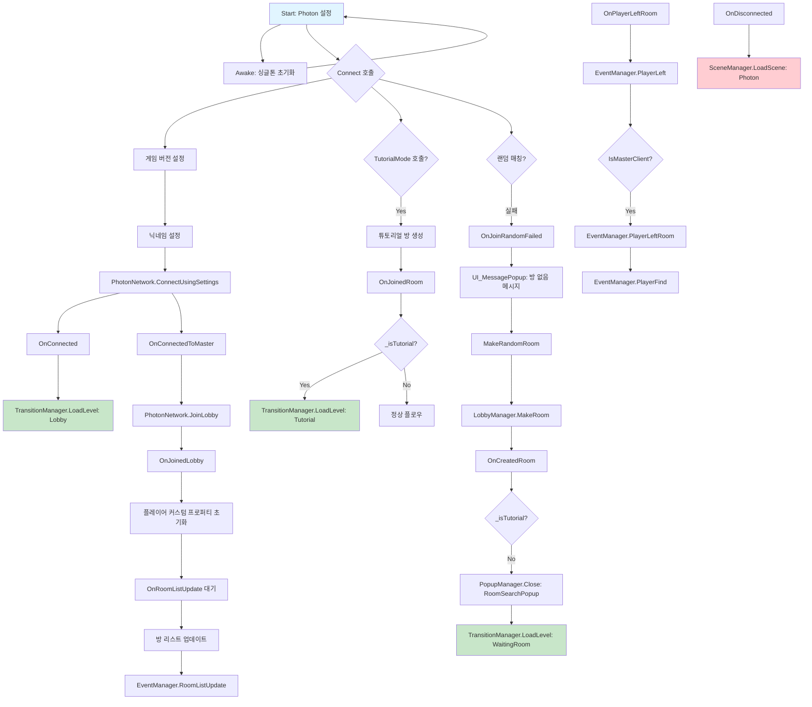

## 2. PopupManager 플로우

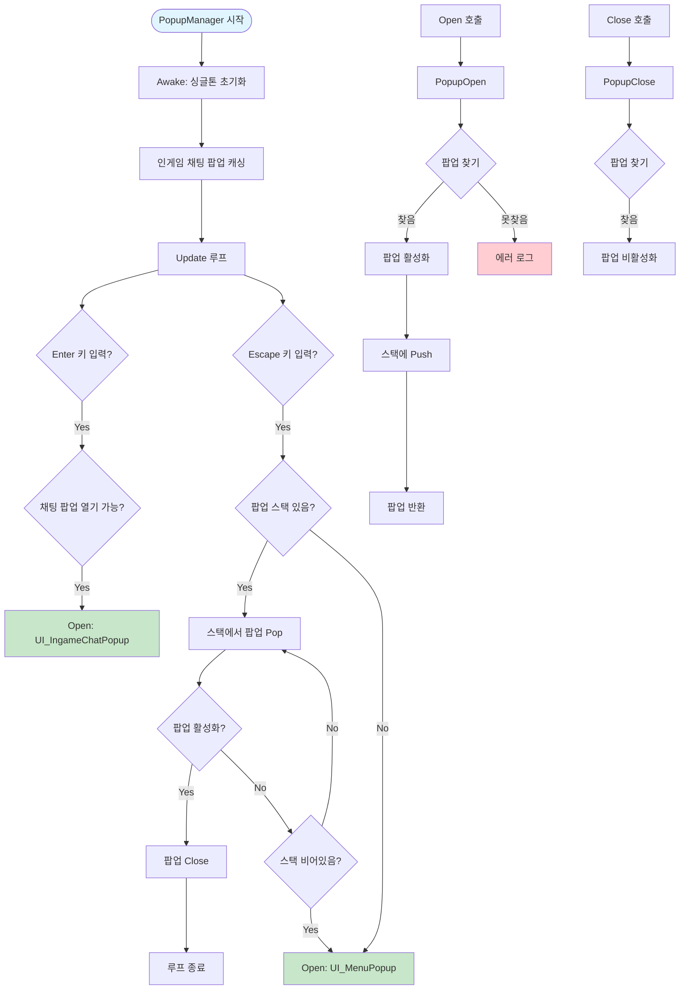

## 3. 팝업 상호작용 플로우

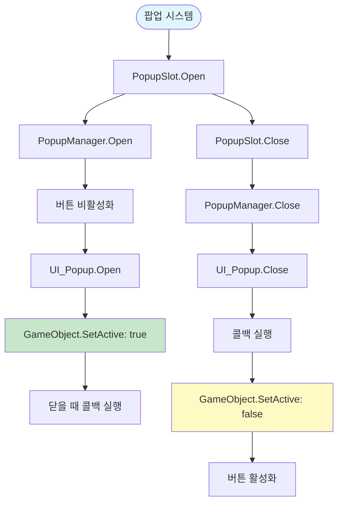

## 4. UI_InformationPopup 플로우

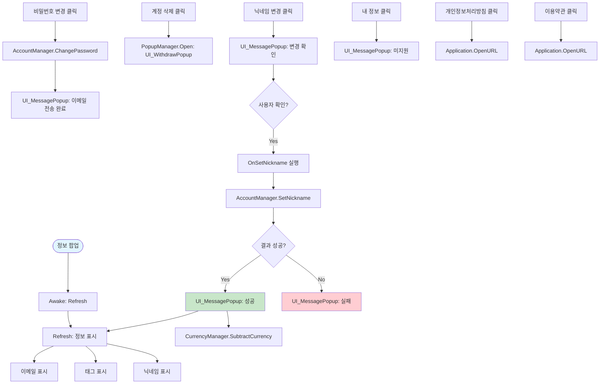

## 5. UI_MessagePopup 플로우

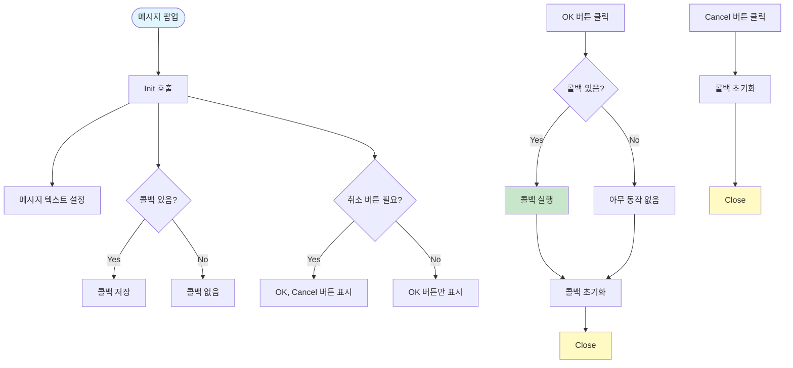

## 6. UI_WithdrawPopup 플로우

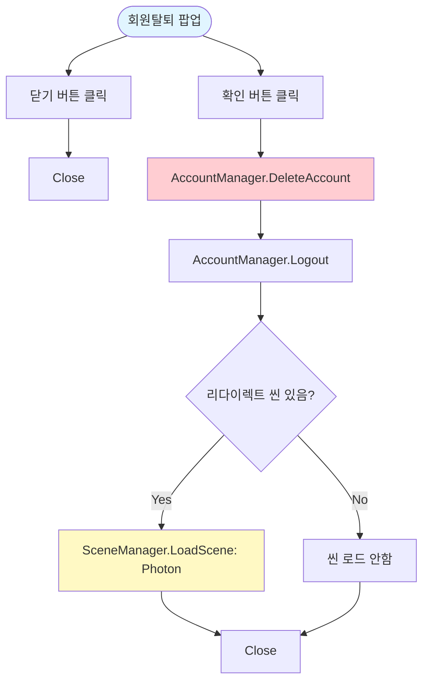

## 7. UI_PasswordPopup 플로우

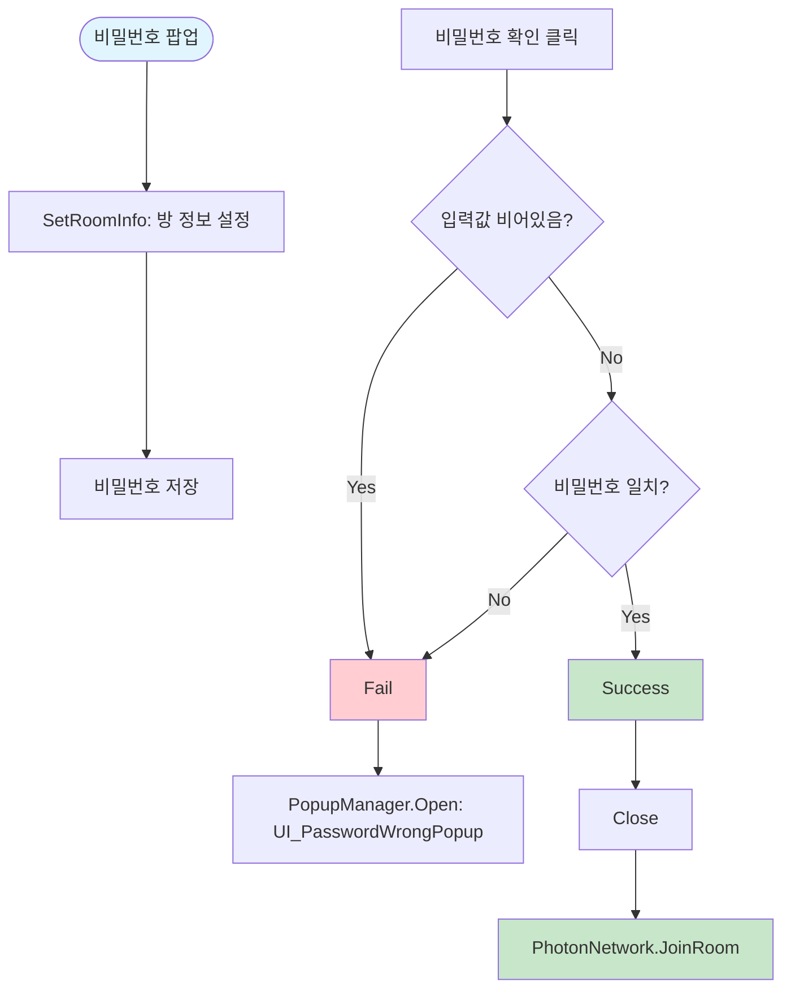

## 8. UI_RoomMakerPopup 플로우

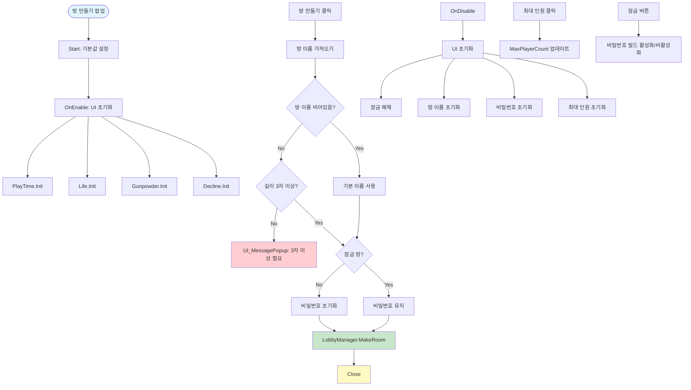

## 9. UI_RoomSearchPopup 플로우

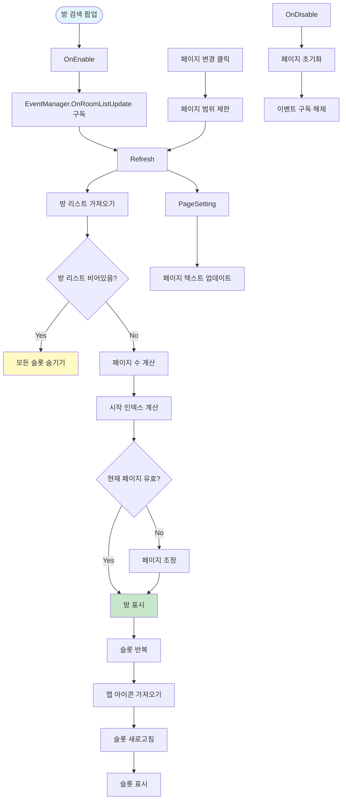

## 10. UI_RoomSetupButton 플로우

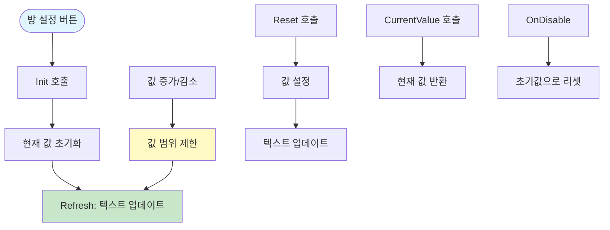

## 11. 전체 시스템 통합 플로우

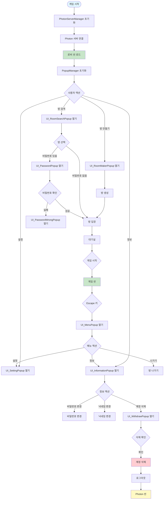

